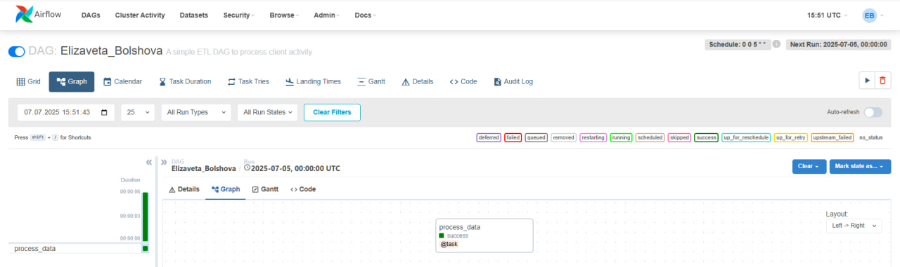
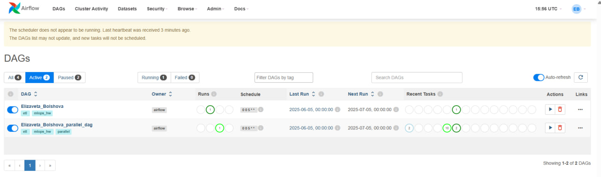

<p align="left">
  
  
  
  
  
</p>

Это учебный проект по MLOPS. Цель проекта — построить ETL-процесс на базе Apache Airflow для расчета витрины с флагами активности клиентов по различным продуктам.

## Описание задачи

Необходимо было реализовать DAG в Apache Airflow, который по расписанию (каждый месяц 5-го числа) запускает расчёт витрины активности клиентов. Также, дополнительно оптимизированная версия DAG, в которой этап `Transform` распараллелен по 10 продуктам для ускорения обработки.

### ETL-процесс

1.  **Extract:** Чтение исходных данных о транзакциях клиентов из файла `profit_table.csv`.
2.  **Transform:** Расчет флагов активности. Клиент считается активным по продукту, если за последние 3 месяца у него были ненулевые транзакции. Логика расчета реализована в скрипте `transform_script.py`.
3.  **Load:** Сохранение рассчитанных флагов в итоговый CSV-файл `flags_activity.csv` в режиме добавления новых данных без перезаписи старых.


## Используемые технологии

*   **Python 3.10**
*   **Apache Airflow** для оркестрации
*   **Pandas** для обработки данных
*   **MySQL** в качестве бэкенда для Airflow
*   **HeidiSQL** как GUI-клиент для администрирования MySQL
*   **WSL (Ubuntu)** как среда для развертывания

---

## Структура проекта
```
├── dags/
│ ├── student_etl_dag.py # Простой DAG 
│ └── task_parallel_dag.py # Параллельный DAG 
├── presentation/ # Скрины проекта
├── scripts/
│ └── transform_script.py # Скрипт с логикой трансформации
├── .gitignore # Файл для исключения временных файлов из Git
└── requirements.txt # Список зависимостей Python
```
---

## Результаты выполнения

### Простой DAG

**Граф DAG `Elizaveta_Bolshova`:**


**Успешный запуск DAG `Elizaveta_Bolshova`:**


### Параллельный DAG

**Граф DAG `Elizaveta_Bolshova_parallel_dag`:**


**Успешный запуск DAG `Elizaveta_Bolshova_parallel_dag`:**

